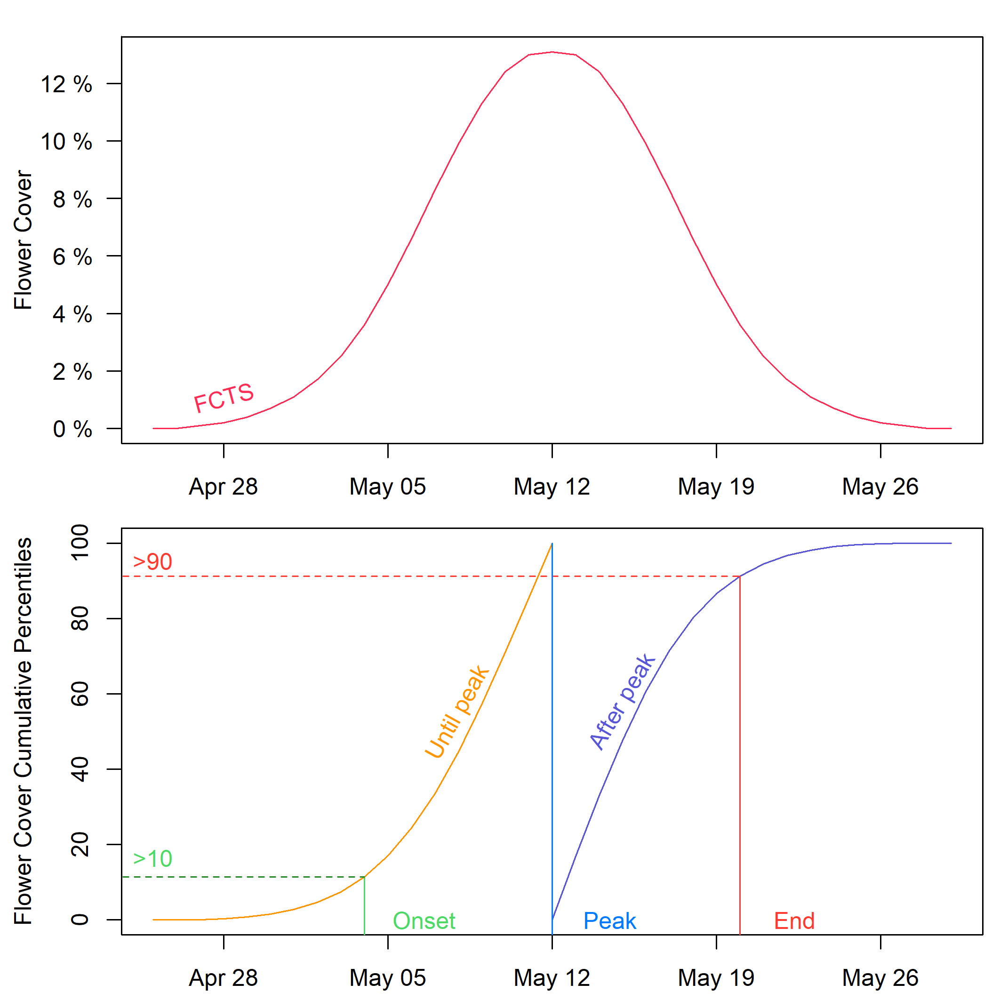

# 4.3 Phenological metric extraction
For each FCTS, onset, peak and end of flowering were extracted. The peak was identified as the day of maximum in the FCTS. Onset of flowering was identified as the first day above the 10th percentile of the cumulative flower cover until peak, whereas the end of the season was identified as the first day above the 90th percentile of the cumulative flower cover after the peak, as explained in Figure 3. In our case study it was not possible to extract all the metrics from all FCTS, since in a few cases flowering started before the start of observations (i.e. spring weeding), and in many cases the peak and the end of flowering were not observed because mowing interrupted grassland development. Therefore, we limited the flowering metrics extraction: the onset was extracted in FCTS having flower cover at the first observation day lower than one third of the maximum flower cover, end of the season in FCTS having flower cover at the last observation day lower than one third of the maximum flower cover, all metrics were extracted only in FCTS with peak after first observation day and before last observation day and flower cover at peak higher than 1%.



```r
library(ggplot2)
library(dplyr)
rm(list=ls())
Sys.setlocale("LC_TIME", "English")
classes<-c("Gra_flower","Kna_arv_flower","Leu_vul_flower","Ran_acr_flower","Green_vegetation","Soil")
classes_flowers<-classes[1:4]

# Upload all the fitted flower covers
fall<-read.csv(stringsAsFactors=T,file="your/folder/path/Phase_4_fitted_flower_cover_long_with_SE.csv",row.names=1)
fall$date<-as.Date(fall0$date)
# keep only FCTS of flowers (remove "Green vegetation" and "Soil" covers)
fall<-fall[fall$class %in% classes_flowers,]

# Upload the plot composition, i.e. the list of species sown in each plot.
compo<-read.csv(your/folder/path/Phase_4_plot_composition.csv")
#create new column for each flower class, specifying if that flower species was sown in that plot
compo$Ran_acr_flower<-grepl("Ranunculus", compo$sp_list)
compo$Leu_vul_flower<-grepl("Leucanthemum", compo$sp_list)
compo$Kna_arv_flower<-grepl("Knautia", compo$sp_list)
compo$Gra_flower<-grepl("Festuca|Avenula|Poa|Anthoxanthum|Phleum|Dactylis|Holcus", compo$sp_list)

# Merge fitted FCTS and sown species list based on plot_ID
merged_df <- merge(fall, compo, by = "plot")

# Create a new column indicating if the flower species in the "class" column was sown in that plot
class_index <- match(merged_df$class, classes_flower)
merged_df$accepted <- merged_df[, classes_flower][cbind(1:nrow(merged_df), class_index)]

limitstart<-10
limitend<-90

#write function to find phenological metrics
findpm<-function(df){
   start<-peak<-end<-NA
   dates<-df$date
   vec<-df$fit
   sum<-cumsum(vec)
   vecbeforepeak<-c(vec[1:which.max(vec)],rep(0,(length(vec)-which.max(vec))))
   vecafterpeak<-c(rep(0,which.max(vec)),vec[(which.max(vec)+1):length(vec)])
   percentilesbeforepeak<-scale(cumsum(vecbeforepeak), center = 0, scale = max(cumsum(vecbeforepeak))) * 100
   percentilesafterpeak<-scale(cumsum(vecafterpeak), center = 0, scale = max(cumsum(vecafterpeak))) * 100
   start<-dates[which(percentilesbeforepeak>limitstart)[1]]
   peak<-dates[which.max(vec)]
   end<-dates[which(percentilesafterpeak>limitend)[1]]
   pm<-c(start,peak,end)
   if(max(vec)<0.01){pm<-NA}
   if(vec[1]>.01){pm[1]<-NA}
   if(vec[length(vec)]>.01){pm[3]<-NA}
   if(peak==max(dates)|peak==min(dates)){pm<-NA}
   return(pm)
}

# Identify flowering phenological metric for each FCTS 
phenometrics<-merged_df%>%
       group_by(plot,class,accepted) %>%
   dplyr::summarize(start = findpm(cur_data())[1],
             peak = findpm(cur_data())[2],
             end = findpm(cur_data())[3])

# Identify flowering phenological metric for FCTS of the sown species
phenometrics_sown<-phenometrics%>%
   filter(accepted==T)
summary(is.na(phenometrics_sown))
```
