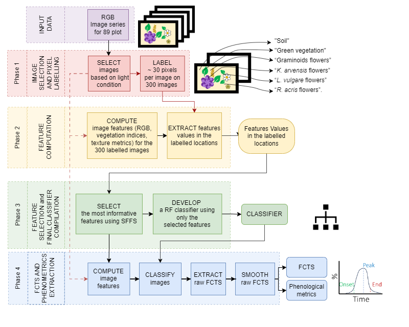

# **Tutorial for the manuscript "Extracting single species flowering phenology from grassland species mixtures using time-lapse cameras"**
by D.Andreatta, V. Klaus, C. Bachofen, M. Dalponte, N.Buchmann.  
Submitted to Remote Sensing of Environment. 
Contact information: davide.andreatta@phd.unipd.it.

In this tutorial you will derive single species flowering phenology time-series and phenological metrics from time-lapse camera images of grasslands captured at the Jena trait-based experiment (Germany). 
The code is developed in R version 4.3.0 (2023-04-21 ucrt).



The proposed workflow can be divided in four phases: 
1. image selection and pixel labelling
     -    1.1 [brightness and contrast extraction](Phase_1_1.md)
     -    1.2 [images selection based on brightness and contrast](Phase_1_2.md)
     -    1.3 [image labelling](Phase_1_3.md)
2. selection of downscaling factor and window size and feature computation
     -    2.1 [feature values extraction](Phase_2_1.md)
     -    2.2 [model comparison](Phase_2_2.md)
3. feature selection and final classifier compilation
     -    3.1 [feature selection and models comparison](Phase_3_1.md)
     -    3.2 [processing time calculation](Phase_3_2.md)
4. FCTS extraction, smoothing and calculation of phenological metrics.
     -    4.1 [FCTS extraction](Phase_4_1.md)
     -    4.2 [FCTS smoothing and display](Phase_4_2.md)
     -    4.3 [Phenological metric extraction](Phase_4_3.md)

to get ready for the tutorial:

## 1. Download the materials:
the materials can be downloaded at the link: LINK TO ETH REPOSITORY HERE
materials include: Images, Region of interests and labels.

## 2. Set up the working environment. 

```
setwd("your/folder/path")
dir.create("Phase_1_2014_raw_indices")
dir.create("Phase_1_2014_filtered_indices_BRIAV_BRISD")
dir.create("Phase_1_lab_xy")
dir.create("Phase_2_df_ws_ext_feat")
dir.create("Phase_3_RF_classifiers")
dir.create("Phase_4_2014_filtered_indices_GCC")
dir.create("Phase_4_Classified_images_for_Fig_5")
dir.create("Phase_4_FCTS")
dir.create("Phase_4_FCTS_plots")
```

## 3. Install the required R packages

```
packages <- c("bigstatsr", "crfsuite", "data.table", "dplyr", "forecast", "ggplot2", 
              "ggpubr", "ggrepel", "ggtext", "glcm", "grid", "gridExtra", "jpeg",
              "lattice", "phenopix", "randomForest", "raster", "readr", "reshape2",
              "rgdal", "sp", "stringr", "terra", "tidyr", "varSel", "zoo")
# Load or install missing packages
lapply(packages, function(package) {
  if (!require(package, character.only = TRUE)) {
    install.packages(package)
    library(package, character.only = TRUE)
  }
})

```
